# Pandemica 🦠

<p align=center>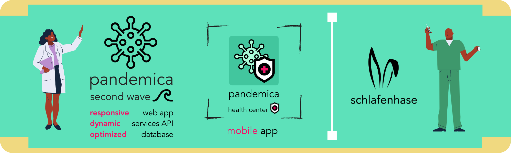</p>

Pandemica is an app to track the development and statistics of a worldwide pandemic. It's built using **Angular** for web,  **ASP .NET Framework** as a service API, **Microsoft SQL Server, PostgreSQL and Atlas MongoDB** for database management, **SwiftUI** and **Kotlin** for a mobile app component.

Main features:

* Beautiful retro flat design
* Stunning graphics and animations
* Easy to use administrator and health center console
* Dynamic table generation
* Fully integrated development stack
* Modern iOS App for health center management 
* Full support for Dark Mode in compatible browsers and iOS app
* Unparalleled attention to detail
* Authentication system for multiple roles
* Seamless spreadsheet analysis for bulk data import
* One-click report PDF export
* Automatic content API switching for better performance and stability

## Photos 📷

Home                  | Home (Dark Mode) |
:-------------------------:|:-------------------------:|
| 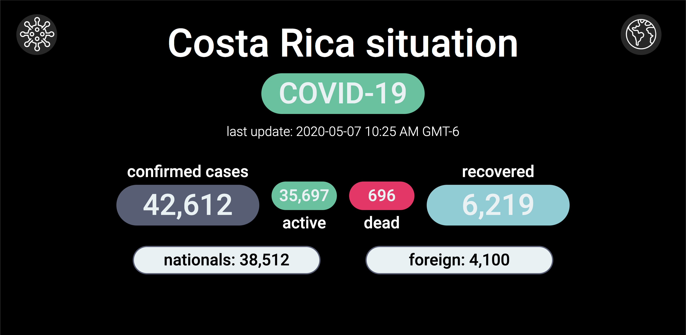 

Home - Scrolled                        | User Access                      |  Country Selector |
:------------------------------:|:------------------------------:|:----------------:
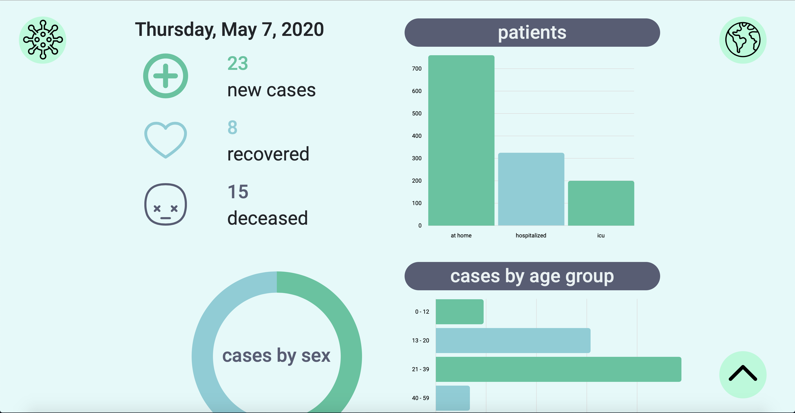  |   | 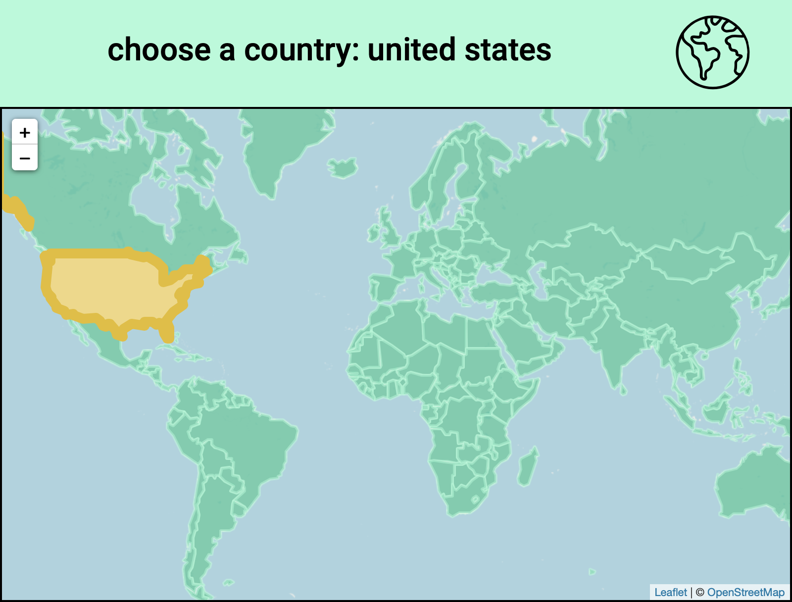

Health Center                       |Administrator Console              | 
:-------------------------:|:-------------------------:
  |  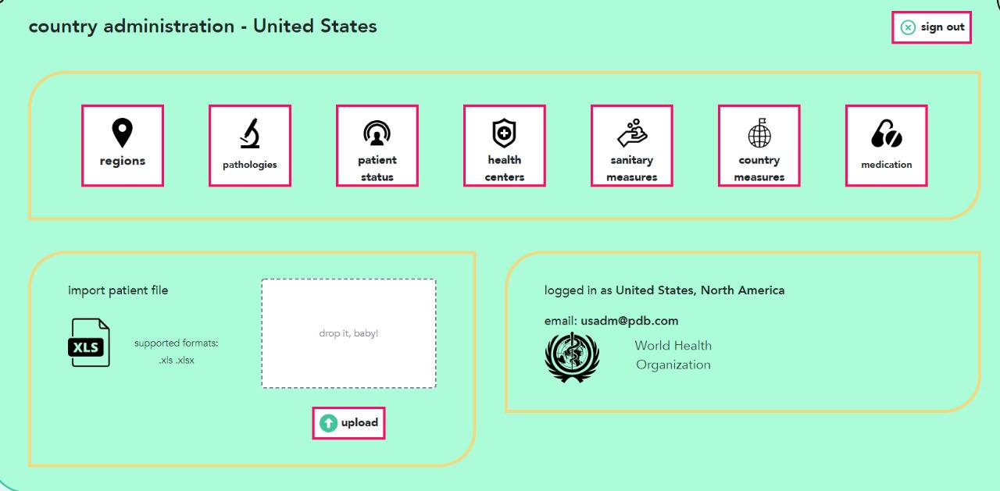

About (Dark Mode)                       |Administrator Console (Dark Mode)              |
:-------------------------:|:-------------------------:
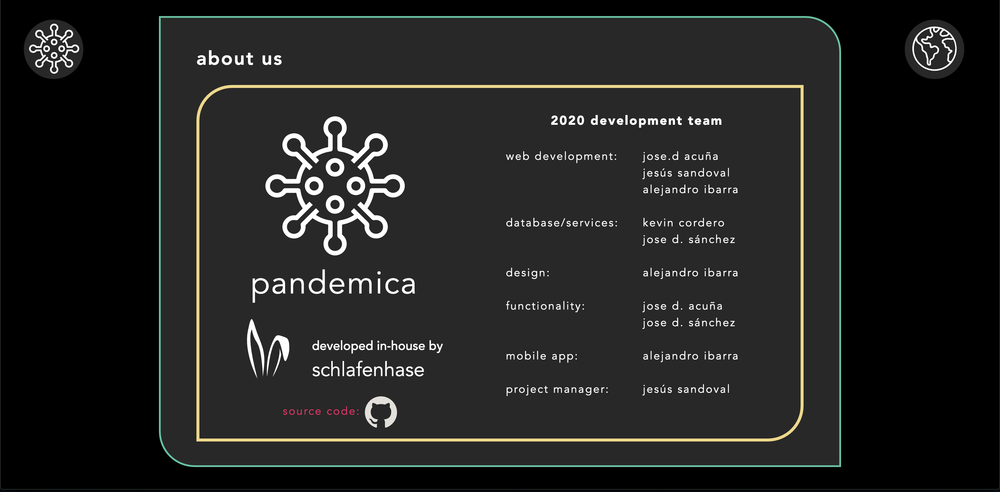  |  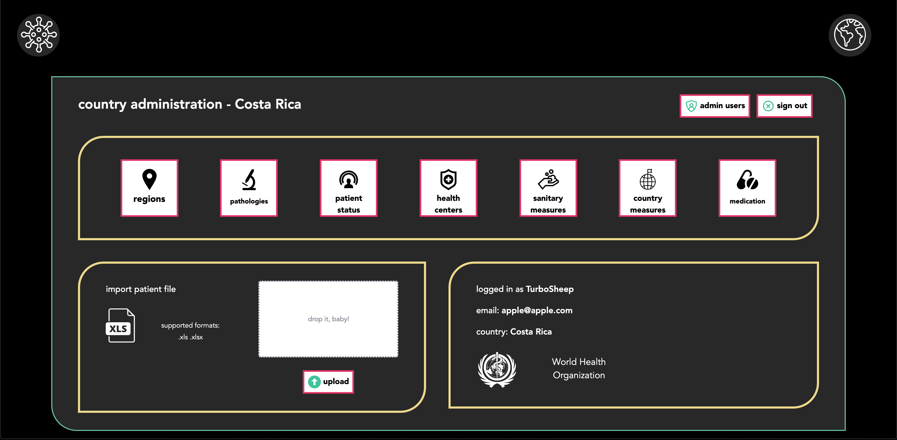 

iOS App Login Screen                        |iOS App Patient View              | iOS App Add Patient         |iOS App Patient View (Dark Mode) |
:-------------------------:|:-------------------------:|:-------------------------:|:-------------------------:
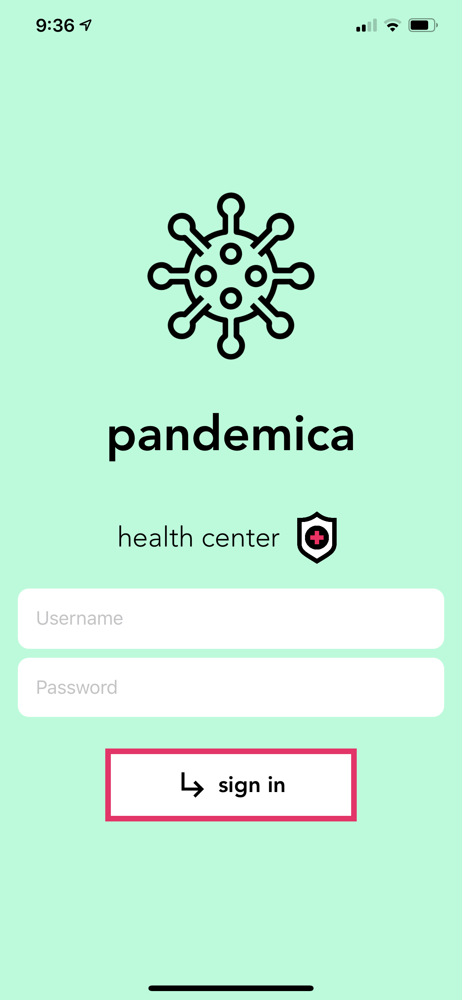  |  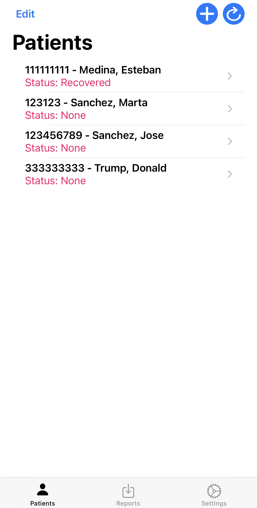 | 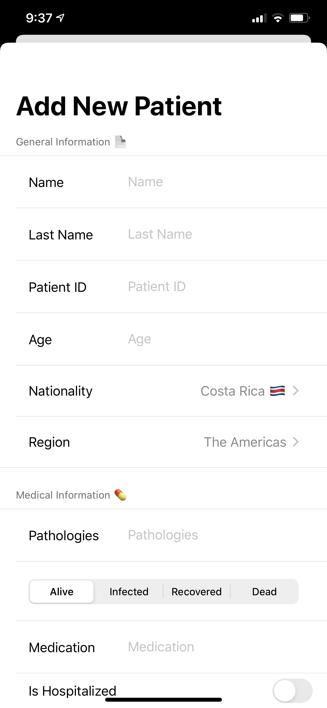  |  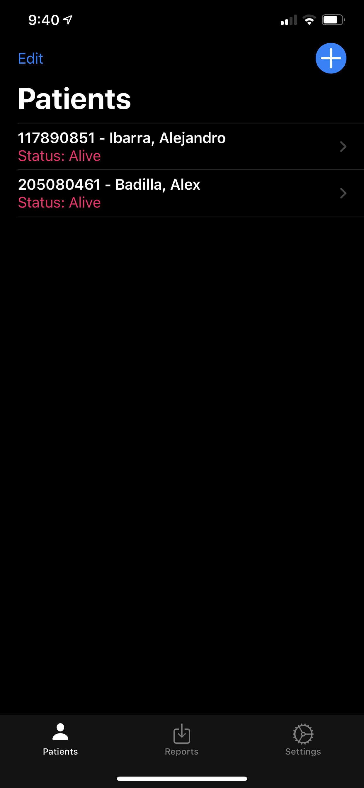

Android App Patient View (Beta)   |Android App Patient View Extended (Beta)              | Android App Reports (Beta)         |Android App Settings (Beta) |
:-------------------------:|:-------------------------:|:-------------------------:|:-------------------------:
  |  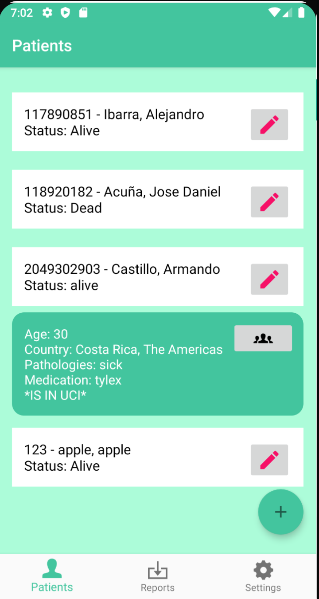 | 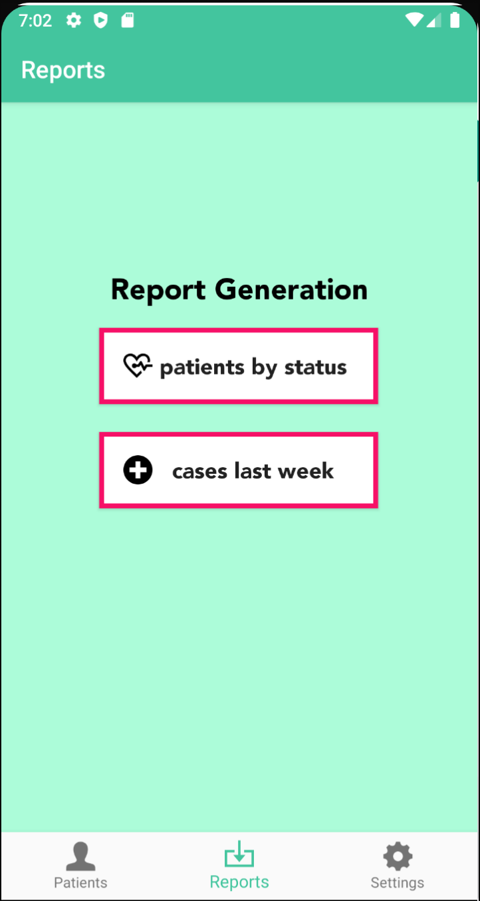  |  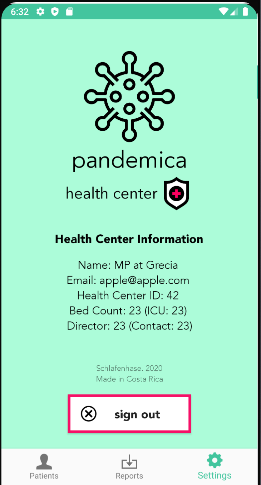

## Getting Started 🚀

These instructions will get you a copy of the project up and running on your local machine for development and testing purposes.

### Prerequisites 👓

Software you need to install to run this project:

```
Website Client - Angular CLI version 9 or higher
Services API - Visual Studio 2019
Mobile App - Xcode 11.6 or higher. Device on iOS/iPadOS 13 or higher
```

### Installing 💻

First, copy the repository on your local machine to get started. The **Web** folder contains all webpage data. Navigate to that directory using Terminal or the equivalent app in your operating system that can access Angular commands. Then, run the following:

```
npm i
```

This will install all required dependencies for the Angular web project, as denoted on the file "package.json". Once that's done, you may now run the local development server using the following command in the same directory.

```
ng serve
```

This will start the Angular development server associated with this project. You can access it at any browser, just type **localhost::4200** in the search bar. Be careful to not close the terminal window, as this will stop the server. You may also use Angular plugins in your IDE that allow you to run the previous terminal command. 

You can check out the general view of the app, but for the full experience you'll need to run the API and Database, which is currently supported on Microsoft Windows platforms only. You could run the server on a Windows PC and connect the clients from another OS via your local network, but it's important that both database and API run on the same computer. To connect from another device on a local network, simply replace the domain "localhost" with the IPv4 address of the server machine. On Windows, the IPv4 address is accessed by running the command "ipconfig" through cmd.

To start, grab a free copy of Microsoft SQL Server and Microsoft SQL Server Management Studio. Create a new database called **PandemicaDB**. Next, run the .bat executable file located in the folder Database/Microsoft SQL Server/Scripts of this project to initialize the local database structure. Once that's done, download Visual Studio (not Code) and open **Server.sln** located in the **Server** folder. Press the start button to run the API on your local network.

Finally, the client web app will update with the server information. Refer to the  PDF document **Pandemica User Guide** in the **Docs** folder for a detailed user guide and more information. The server IP where data is being fetched from can be modified in the file **environment.ts**, located on the Web/src/environment folder of this project.

Our tests were made on Windows computers running Angular 9, Visual Studio and SQL Server 2019 for the full stack, and Mac computers for front end development.

#### iOS SwiftUI Mobile App 📱

We include a mobile app for health center managers to view and update patient information, as well as generating reports. It's built with Swift as an iOS standalone **native** application. It is located in the folder "Mobile App/PandemicaHC-iOS". To get started, open the file **Pandemica.xcworkspace** with Xcode 11.5 or higher. It uses CocoaPods for some features, but all pods are currently included in the repository, so there's no need to download them separately. Also, Xcode will automatically download the required packages using the Swift Package Manager.

You need to replace the IP of the server in the file **Constants.swift** located on the /Data folder with the IP of your the machine the server is running on. If you're using a personal computer, look for the IPv4. Make sure to have both devices connected to the same network. By default, it uses our hosted Pandemica API and database.

Our tests were made on an iPhone 11 Pro Max and iPad Pro 3rd generation running iOS 13.5 and iOS 14.0 beta, and a MacBook Pro 2019 running Xcode 11.5 and 12.0 beta. The Xcode IDE and SDK only work on macOS at this time.

#### Android Mobile App (Beta) 🤖

Pandemica Health Center is also supported as a beta for Android platforms. You can simply open the app folder located in "Mobile App/PandemicaHC-Android" using Android Studio and all dependencies will be automatically downloaded using Gradle. It is currently in beta as some features are not completely implemented like in the iOS version.

## Deployment ✅

For deployment on a live system, refer to the PDF document **Pandemica Deployment Guide**, located on the **Docs** folder of this GitHub project.

## Built With 🛠

<table>
  <tr>
    <td>
      <p align=center></p>
    </td>
    <td>
      <p align=center></p>
    </td>
    <td>
      <p align=center></p>
    </td>
    <td>
      <p align=center></p>
    </td>
    <td>
      <p align=center></p>
    </td>
  </tr>
  
  <tr>
    <td>
      <p align=center><a href="https://www.angular.io/"><b>Angular</b></a>
      </br>Web Framework</p>
    </td>
    <td>
      <p align=center><a href="https://dotnet.microsoft.com/apps/aspnet"><b>ASP .NET Framework</b></a>
      </br>Services API</p>
    </td>
    <td>
      <p align=center>
        <a href="https://developer.apple.com/xcode/swiftui/"><b>SwiftUI</b></a>
      </br>iOS App<br>GUI Framework</p>
    </td>
    <td>
      <p align=center>
        <a href="https://kotlinlang.org"><b>Kotlin</b></a>
        </br>Android App<br>Language</p>
    </td>
    <td>
      <p align=center>
        <a href="https://www.microsoft.com/en-us/sql-server/sql-server-2019"><b>Microsoft SQL Server</b></a>
      </br>Database Engine</p>
    </td>
  </tr>
</table>

## Docs 📖

Refer to the [**Docs**](https://github.com/AlejandroIbarraC/Pandemica/tree/master/Docs) folder at the root of the project for more information about usage and organization.

## Authors 👨🏻‍💻

### *Schlafenhase Development Team* 🐰

* **Jose D. Acuña** - *Web Functionality Manager & Design Assistant* - [JoDaniel1412](https://github.com/JoDaniel1412)
* **Kevin Cordero** - *Lead Developer on Back-end and Connections* - [Skryfall](https://github.com/Skryfall)
* **Alejandro Ibarra** - *Lead Designer and Marketing. Mobile App Developer.* - [AlejandroIbarraC](https://github.com/AlejandroIbarraC)
* **Jose D. Sánchez** - *Database Administration & Definition* - [JoseDavidSS](https://github.com/JoseDavidSS)
* **Jesús Sandoval** - *Project Manager & Web Developer* - [shuzz22260427](https://github.com/shuzz22260427)

## License 📄

This project is licensed under the MIT License - see the [LICENSE.md](https://github.com/AlejandroIbarraC/Pandemica/tree/master/LICENSE.md) file for details

## Acknowledgments 📎

* Costa Rica Institute of Technology
* MP

<p align="center">
  
                                                                             
</p>
<p align="center">This project was made with academical purposes. Schlafenhase. 2020</p
```
